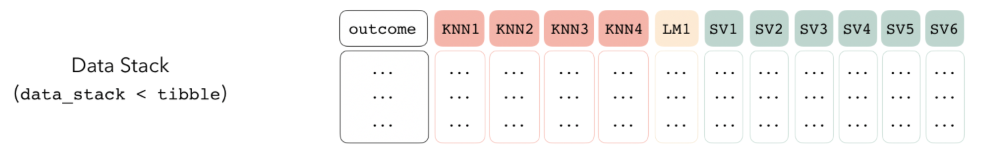
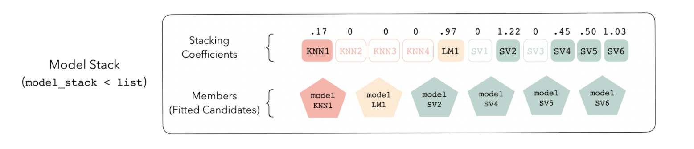

[Stacking](https://machinelearningmastery.com/stacking-ensemble-machine-learning-with-python/#:~:text=Stacked%20Generalization%20or%20%E2%80%9CStacking%E2%80%9D%20for,dataset%2C%20like%20bagging%20and%20boosting.) is an esemble machine learing algorithm that involves combining predictions from multiple machine learning models on the same dataset.


# 1. Load Packages
```{r setup, include = FALSE}
knitr::opts_chunk$set(
  collapse = FALSE,
  comment = "#",
  message = FALSE,
  warning = FALSE,
  cache = FALSE,
  fig.align = "center",
  class.source = 'white'
)

# Set knit directory to project directory
# knitr::opts_knit$set(root.dir = 'C:/Users/dylan/OneDrive/Documents/bitcoin-forecasting')
```

```{r}
library(tidyverse)  # Data manipulation
library(tidymodels) # Building machine learning workflows and models
library(Quandl) # Download datasets
library(tidyquant)  # Functions for collecting and analyzing financial data
library(timetk)  # Functions to visualize, wrangle, and feature engineer time series data for forecasting and machine learning prediction
library(xgboost) # Machine learning algos
library(vip) # For constructing variable importance plots
library(stacks) # to create stacks for ensembling
library(caret) # for confusion matrix


# For parallel processing
all_cores <- parallel::detectCores(logical = FALSE)

library(doParallel)
cl <- makePSOCKcluster(all_cores)
registerDoParallel(cl)
```


# 2. Extracting Data/Adding features
## 2.1 Getting Bitcoin Prices
Here the data will be pulled from the a csv file which was exported from the previous few articles on scrapping and NLP. This includes sentiment data harvest from investing.com and from reddit threads relating to bitcoin. Additionally, features that include technical indicators, currency indexes and other features that could possibly be related to bitcoin price, were also added.

```{r}
# Read Data
bitcoin_price <- read_csv("../data/bitcoin_price.csv")

# Cleaning
bitcoin_price[bitcoin_price == 0] <- NA
bitcoin_price <- bitcoin_price %>%
  map_df(na.locf)


# Defining Target
bitcoin_model <- bitcoin_price %>%
  # using open price as the first available window
  tq_mutate(select = close,
            mutate_fun = periodReturn,
            period='daily',
            type='arithmetic',
            col_rename='future_return') %>%
  mutate(future_return=lead(future_return),
         future_return_sign = as.factor(ifelse(future_return > 0, 1, 0))) %>%
  select(date, open, close, volume_btc, volume_currency, future_return, future_return_sign) %>%
  .[!is.na(.$future_return),]


rmarkdown::paged_table(bitcoin_model %>% head())
```

## 2.2 Getting Bitcoin Features
```{r}
# Importing features from online sources (Marcus)
bitcoin_features <- read_csv("../data/bitcoin_features.csv") %>%
  mutate(date=as.Date(date, format =))

# Add sentiment features from reddit (Darren)
bitcoin_features <- bitcoin_features %>% 
  left_join(read_csv("../data/bitcoin_reddit.csv"), by="date")

# Add sentiment features from news sites (QL)
bitcoin_features <- bitcoin_features %>% 
  left_join(read_csv("../data/bitcoin_news.csv") %>%
              mutate(date = as.Date(date, format = "%d/%m/%y")), by="date")

rmarkdown::paged_table(bitcoin_features %>% head())
```


## 2.3 Merge all data into 1 tibble
```{r}
# Combine price data with features
bitcoin_model <- bitcoin_model %>%
  left_join(bitcoin_features, by="date")

rmarkdown::paged_table(bitcoin_model %>% head())
```


# 3. Train/Test Data Split
```{r}
set.seed(123)

# Creating the training set
train <- bitcoin_model %>%
  filter(between(date, as.Date("2018-01-01"), as.Date("2020-06-30")))

# 2020 data is kept completely out, purely for testing
test <- bitcoin_model %>%
  filter(between(date, as.Date("2020-07-01"), as.Date("2020-11-29")))

# Checking for NAs
#sapply(train, function(x) sum(is.na(x)))

rmarkdown::paged_table(train %>% head())
```

# 4. Creating general data pre-processing recipe 
```{r}
# excluding columns not used for prediction
# a general recipe for preprocessing train data
recipe_spec <- recipe(future_return_sign ~ ., data = train) %>%
  update_role(date, future_return, close, open, new_role = "ID")
```

# 5. Creating folds
```{r}
# Cross Validation Folds for Tuning. Produces 7 folds.
resamples_cv <- recipe_spec %>%
  prep() %>%
  juice() %>% 
  time_series_cv(
    date_var = date,
    initial = '3 month',  # No. of data points from original data that are in analysis (training set)
    assess = '3 month',   # No. of data points from original data that are in assessment (testing set)
    skip = '3 month',     # Increment of resampling data set on assessment set only.
    cumulative = TRUE,    # TRUE, Analysis set will grow as resampling continues. Assessment set size remains static
  )

# Plot resampling timeline for each fold
resamples_cv %>% 
  plot_time_series_cv_plan(
        date, close, # date variable and value variable
        # Additional arguments passed to plot_time_series(),
        .facet_ncol = 2,
        .line_alpha = 0.5,
        .interactive = FALSE,
    )
```

# 6. Models for stacking

In this section, we will define several model workflows and use `tune_grid()` for hyperparameter tuning. Unlike ordinary tuning where the best models will be selected, our approach differs.

We will attempt to tune only for the purpose of generating multiple variations of the same model with different hyperparameters. These different models will then be added to a stack, allowing the stacking algorithm to select the models that are the most important and allowing it to give a weighted-average or meta-model ensemble that would be more robust than a tuned model that stands on its own. 


## 6.1 Convenience functions
To start on the model workflows, we first create some convenience functions that are related to stacking so that they can be used in our modelling workflow.

These functions are similar to `control_grid()` and `control_resamples()` under the normal circumstances where there is no stacking. `control_stack_grid()` is used when there is hyperparameter tuning, while `control_stack_resamples()` is used when there is no tuning.

```{r}
# Convenience functions. Set save_pred = TRUE, save_workflow = TRUE
# To be used in tune_grid(control = ) later for each model
ctrl_grid <- control_stack_grid()
ctrl_res <- control_stack_resamples()
```


## 6.2 XGBoost model
```{r}
xgb_model <- boost_tree(learn_rate = 0.01,
                        tree_depth = tune(),
                        min_n = 1,
                        mtry = 500,
                        trees = tune(),
                        stop_iter = 50) %>%
  set_engine('xgboost') %>%
  set_mode('classification')

# Workflow for the entire model
xgb_wflw <- workflow() %>%
  add_recipe(recipe_spec) %>%
  add_model(xgb_model)

# creating a grid to tune trees
# number of models =5^3 = 125
xgb_params <- grid_regular(trees(),
                           tree_depth(),
                           levels = 5)

# Fit models at all different values chosen for each hyperparameter
# 7 Folds. Results reported for each row.

xgb_model_results <- xgb_wflw %>% tune_grid(
  grid = xgb_params,
  # metrics = metric_set(accuracy, roc_auc, mn_log_loss),  # Mean log loss
  resamples = resamples_cv,
  control = ctrl_grid)


# Display results in a tidy tibble
# Each model would be ran using the cross-fold validation. Average performance statstics reported back.
# Note that the cross-fold validation models are not kept. Only using cross-fold validation to calculate performance statistics for us to choose which model parameters to use.
# no. of models x no. of metrics
xgb_model_results %>%
  collect_metrics()
```

## 6.3 Support Vector Machine
```{r}
# creating model specifications
svm_spec <- svm_rbf(
    cost=tune(),
    rbf_sigma=tune()
  ) %>%
  set_engine("kernlab") %>%
  set_mode("classification")

# Creating a parameter grid
# grid_regular chooses sensible values for cost and rbg_sigma
# number of total models = 5*5 = 25
svm_grid <- grid_regular(cost(),
                         rbf_sigma(),
                         levels=5)

# Creating workflow
svm_wflow <- workflow() %>%
  add_model(svm_spec) %>%
  add_recipe(recipe_spec)

# Results of the model. These results will be added to the stack.
svm_results <- svm_wflow %>%
  tune_grid(
    resamples=resamples_cv,
    grid=svm_grid,
    control=ctrl_grid
  )

svm_results %>%
  collect_metrics()
```


## 6.4 Random Forest
Usually low maintenance and performs well. Here we use ranger and random forest engines to see how a random forest model would perform.

### 6.4.1 Ranger
```{r}
rf_ranger_spec <- rand_forest(trees = tune(),
                              min_n=tune()
                       
  ) %>%
  set_engine("ranger") %>%
  set_mode("classification")

# Creating a parameter grid
# grid_regular chooses sensible values for trees and min)n
# number of total models = 5^3 = 125
rf_ranger_grid <- grid_regular(trees(),
                               min_n(),
                               levels=5)

# Creating workflow
rf_ranger_wflow <- workflow() %>%
  add_model(rf_ranger_spec) %>%
  add_recipe(recipe_spec)

# Results of the model
rf_ranger_results <- rf_ranger_wflow %>%
  tune_grid(
    resamples=resamples_cv,
    grid=rf_ranger_grid,
    control=ctrl_grid
  )

rf_ranger_results %>%
  collect_metrics()
```

### 6.4.2 randomForest
```{r}
rf_randomForest_spec <- rand_forest(trees = tune(),
                                    min_n=tune()
                       
  ) %>%
  set_engine("randomForest") %>%
  set_mode("classification")

# Creating a parameter grid
# grid_regular chooses sensible values for trees and min)n
# number of total models = 5^3 = 125
rf_randomForest_grid <- grid_regular(trees(),
                                     min_n(),
                                     levels=5)

# Creating workflow
rf_randomForest_wflow <- workflow() %>%
  add_model(rf_randomForest_spec) %>%
  add_recipe(recipe_spec)

# Results of the model
rf_randomForest_results <- rf_randomForest_wflow %>%
  tune_grid(
    resamples=resamples_cv,
    grid=rf_randomForest_grid,
    control = ctrl_grid
  )

rf_randomForest_results %>%
  collect_metrics()
```


## 6.4 Null model
A [null model](https://smltar.com/mlclassification.html#classfirstattemptlookatdata) or a baseline model is a simple, non-informative model that always predicts the largest class for classification. Such a model is perhaps the simplest heuristics or rull-based alternative that we can consider as we assess our modelling efforts. Even though the null model might not be the most useful, let's just have it go through stacking to see if it is able to provide any additional information.
```{r}
null_classification <- null_model() %>%
  set_engine("parsnip") %>%
  set_mode("classification")

# note that control_resamples() was used here as there was no hyperparameter tuning.
null_results <- workflow() %>%
  add_recipe(recipe_spec) %>%
  add_model(null_classification) %>%
  fit_resamples(
    resamples_cv,
    control=control_stack_resamples()
  )


# results of a null model
null_results %>% collect_metrics()
```

## 6.4 Neural Networks
```{r}
nnet_spec <- mlp(penalty = tune(),
                 epochs = tune()) %>%
  set_mode("classification") %>%
  set_engine("nnet")

# Define Workflow
nnet_wflow <- workflow() %>%
  add_recipe(recipe_spec) %>% 
  add_model(nnet_spec)

# Grid for tuning
# 5^2 = 25number of nn models
nnet_grid <- grid_regular(penalty(),
                          epochs(),
                          levels=5)

# Perform tuning and cross-validation on training set
nnet_results <- nnet_wflow %>%
  tune_grid(
    resamples = resamples_cv, 
    grid = nnet_grid,
    # metrics = metric_set(accuracy, roc_auc, mn_log_loss),
    control = ctrl_grid
  )

nnet_results %>% collect_metrics
```


## 6.5 Logistic Regression
```{r}
logistic_spec <- logistic_reg(penalty=tune(),
                              mixture=tune()) %>%
  set_engine("glmnet") %>%
  set_mode("classification")

# Creating a parameter grid
# grid_regular chooses sensible values for trees and min)n
# number of total models = 5^3 = 125
logistic_grid <- grid_regular(penalty(),
                              mixture(),
                              levels=5)

# Creating workflow
logistic_wflow <- workflow() %>%
  add_model(logistic_spec) %>%
  add_recipe(recipe_spec)

# Results of the model
logistic_results <- logistic_wflow %>%
  tune_grid(
    resamples = resamples_cv, 
    grid = logistic_grid,
    # metrics = metric_set(accuracy, roc_auc),
    control = ctrl_grid
  )


logistic_results %>% collect_metrics
```

## 6.6 Other Classification models
Other classification models available in parsnips include:

* decision_tree

* bag_tree

* nearest_neighbour


# 7. stacking

Stacking is when we add different models together into a `data_stack` object through the `add_candidates()` function.

The end result is simply a tibble of different models and their predictions together with the actual y-variable we are trying to predict.

```{r}
# add_candidates() adds ensemble members to the stack
stacked_model <- stacks() %>%
  add_candidates(xgb_model_results) %>%
  add_candidates(svm_results) %>%
  add_candidates(rf_ranger_results) %>%
  add_candidates(rf_randomForest_results) %>%
  add_candidates(null_results) %>%
  add_candidates(nnet_results) %>%
  add_candidates(logistic_results)

stacked_model
```

Showing the results of the different models in the data_stack object. The first column contains actual future_return_sign (our target variable). Every other column contains the predicted values for each of the models that we have added into the stack.


```{r}
as_tibble(stacked_model)
```

First column is the actual value and the remaining columns gives the predictions for each ensemble member. Now we need to evaluate how to combine predictions together by using `blend_predictions()`. This is espeically important as ensemble members are highly correlated. Therefore the `blend_predictions()` helps to perform regulaization to figure out how the stack mamebrs can be combined. This stacking coefficeints determine which ensemble members can be used in our ensemble. Applying a lasso regression, it assigns weights to each of these models based on their predicted values in comparison to that of the actual y variable value. Additionally, members that are very highly correlated together will not be selected. Therefore, allowing us to get the best possible mix of models for the ensemble.

If stacking coefficients are non-zero, they will be included in the model.




```{r}
stacked_model_blended <- stacked_model %>%
  blend_predictions(penalty = seq(0, 1, 0.1))

stacked_model_blended
```


```{r}
autoplot(stacked_model_blended, type = "weights")
```

We can use autoplot to see if got the right trade off.
```{r}
autoplot(stacked_model_blended)
```

Fitting the different members of the ensemble into the model.
```{r}
stacked_model_blended_model <- stacked_model_blended %>%
  fit_members()
```


# 8. Performance of the ensemble
Checking the performance of the model on data that was completely left out of the training data.
```{r}
test_predict <- test %>%
  bind_cols(predict(stacked_model_blended_model, .))


confusionMatrix(factor(test_predict$.pred_class),
                factor(test_predict$future_return_sign))
```

The ensemble has performed relatively well, giving an accuracy of 73.68%. However, 1 key issue might be a realtively high number of false postive results and it is possible that days with huge falls in bitcoin pricing could affect the returns.


```{r eval = FALSE}
#Writing csv for use for model evaluation
test_predict %>%
  select(date, pred_class=.pred_class) %>%
  write.csv("../data/ensemble_predict_updated.csv")
```

