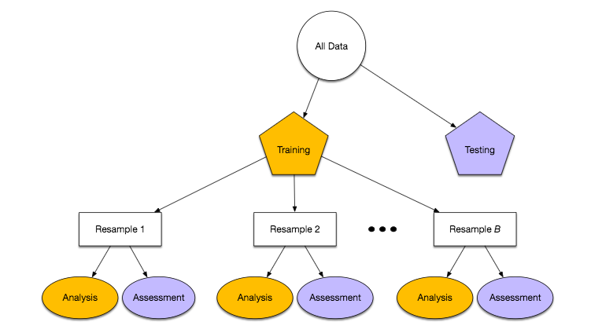

In this section, we create a machine learning model to predict the direction of change in Bitcoin prices. The predictors we use are the ones we have created with feature engineering.

# 1. Load Packages
```{r setup, include = FALSE}
knitr::opts_chunk$set(
  collapse = FALSE,
  comment = "#",
  message = FALSE,
  warning = FALSE,
  cache = FALSE,
  fig.align = "center",
  class.source = 'white'
)

# Set knit directory to project directory
```

```{r}
library(tidyverse)  # Data manipulation
library(tidymodels) # Building machine learning workflows and models
library(Quandl) # Download datasets
library(tidyquant)  # Functions for collecting and analyzing financial data
library(timetk)  # Functions to visualize, wrangle, and feature engineer time series data for forecasting and machine learning prediction
library(xgboost) # Machine learning algos
library(vip) # For constructing variable importance plots
library(caret) # Confusion matrix
library(stacks) # Ensemble
```

```{r}
# Set dates for this project. YMD Format.
sDate = "2018-01-01"
eDate = "2020-11-30"
```

# 2. Extracting Data/Adding features

We start by importing the Bitcoin prices as well as the features we have prepared in the data folder.

## 2.1 Getting Bitcoin Prices
```{r}
# Get Bitcoin prices from Quandl. YMD.
# Quandl.api_key("5ydoG6gTCKjgzDpJp_1s") # 3GAtxPrAgoah7PyADPGy
# bitcoin_price <- Quandl("BCHARTS/BITSTAMPUSD", start_date=sDate, end_date=eDate) %>%
#   arrange(Date) %>%
#   as_tibble()
# colnames(bitcoin_price) <- c("date", "open", "high", "low", "close", "volume_btc", "volume_currency", "weighted_price")
# write_csv(bitcoin_price, 'data/bitcoin_price.csv')

# Read Data
bitcoin_price <- read_csv("../data/bitcoin_price.csv")

# Cleaning
bitcoin_price[bitcoin_price == 0] <- NA
bitcoin_price <- bitcoin_price %>%
  map_df(na.locf)

# Defining Target (Close to Close)
# bitcoin_model <- bitcoin_price %>%
#   select(date, open, close) %>%
#   tq_mutate(select = close,
#             mutate_fun = periodReturn,
#             period = 'daily',
#             type = 'arithmetic',
#             col_rename = 'future_return') %>%
#   mutate(future_return_sign = as.factor(ifelse(future_return > 0, 1, 0))) %>%
#   # Shift up future_returns and sign by 1. Use today's data to predict tomorrow's returns.
#   # future_returns indicates the returns if I buy at today's close and sell at tmrrw's close
#   # each row represent today
#   mutate_at(c("future_return", "future_return_sign"), lead)
# bitcoin_model <- bitcoin_model[-nrow(bitcoin_model), ]

# Defining Target (Open to Open)
bitcoin_model <- bitcoin_price %>%
  select(date, open, close) %>%
  tq_mutate(select = close,
            mutate_fun = periodReturn,
            period = 'daily',
            type = 'arithmetic',
            col_rename = "change") %>%
  rename(close_1d_change = change) %>%
  tq_mutate(select = open,
            mutate_fun = periodReturn,
            period = 'daily',
            type = 'arithmetic',
            col_rename = 'future_return') %>%
  mutate(future_return = lead(future_return, n=2, default = 0),
         future_return_sign = as.factor(ifelse(future_return > 0, 1, 0)))
bitcoin_model <- bitcoin_model[-nrow(bitcoin_model), ]

rmarkdown::paged_table(bitcoin_model %>% head())
```

## 2.2 Getting Bitcoin Features
```{r}
# Importing features from online sources (Marcus)
bitcoin_features <- read_csv("../data/bitcoin_features.csv")
# Add sentiment features from reddit (Darren)
bitcoin_features <- bitcoin_features %>% 
  left_join(read_csv("../data/bitcoin_reddit.csv"), by="date")
# Add sentiment features from news sites (QL)
bitcoin_features <- bitcoin_features %>% 
  left_join(read_csv("../data/bitcoin_news.csv") %>% mutate(date = as.Date(date, format = "%d/%m/%y")), by="date")

# Remove lastest date to match bitcoin prices and future returns
bitcoin_features <- bitcoin_features[-nrow(bitcoin_features), ]

rmarkdown::paged_table(bitcoin_features %>% head())
```


## 2.3 Merge all data into 1 tibble
```{r}
# Combine price data with features
bitcoin_model <- bitcoin_model %>%
  left_join(bitcoin_features, by="date")

rm(bitcoin_features)
rm(bitcoin_price)

rmarkdown::paged_table(bitcoin_model %>% head())
```


# 3. Train/Test Data Split

Similar to the time series model, we will be using Bitcoin price data from January 2018 to June 2020 as the training data, and price data from July to November 2020 as the test data. 


```{r}
# YMD format
train <- bitcoin_model %>% filter(between(date, as.Date("2018-01-01"), as.Date("2020-06-30")))
test <- bitcoin_model %>% filter(between(date, as.Date("2020-07-01"), as.Date("2020-11-28")))
```

# 4. Create Recipe

In the first step of our `tidymodels` workflow, we start with the recipe. Since we are trying to predict the direction of the change in Bitcoin prices, we will set the "future_return_sign" column as the target variable, and all other columns as the predictors.

```{r}
# Recipe using the train set
recipe_spec <- recipe(future_return_sign ~ ., data = train) %>%
  update_role(date, open, close, close_1d_change, future_return, new_role = "ID") # Exclude these columns from the model. Only used for ID purpose

```

# 5. Create resamples from cross validation folds of 3 months for tuning

Next, we create resamples of the training data for cross-validation. 

```{r}
# Cross Validation Folds for Tuning. Produces 9 slices
resamples_train <- recipe_spec %>%
  prep() %>%
  juice() %>% 
  time_series_cv(
    date_var = date,
    initial = '3 month',  # No. of data points from original data that are in analysis (training set)
    assess = '3 month',   # No. of data points from original data that are in assessment (testing set)
    skip = '3 month',     # Increment of resampling data set on assessment set only.
    cumulative = TRUE    # TRUE, Analysis set will grow as resampling continues. Assessment set size remains static
  )

# Plot resampling timeline for each fold
resamples_train %>% 
  plot_time_series_cv_plan(
        date, close, # date variable and value variable
        .facet_ncol = 2,
        .line_alpha = 0.5,
        .interactive = FALSE
    )
```

# 6. Define Model

We chose a XGBoost model because of it reduces variance and bias. Each model is trained based on the the previous model's residuals, which prevents overfitting to the training data.

```{r}
rf_model <- boost_tree(learn_rate = 0.01,
                        tree_depth = tune(),
                        min_n = tune(),
                        mtry = 500,
                        trees = 100,
                        stop_iter = 50) %>%
  set_engine('xgboost') %>%
  set_mode('classification')

rf_model
```

# 7. Create Workflow

With the receipe and model ready, we can start creating our workflow according to the `tidymodels` framework.

```{r}
rf_wflw <- workflow() %>%
  add_recipe(recipe_spec) %>%
  add_model(rf_model)

rf_wflw
```

# 8. Tuning

We perform hyperparamter tuning for the "tree_depth" and "min_n" parameters to explore different XGBoost models to come up with one that gives the most accurate predictions after cross-validation.

## 8.1 Create grid for tuning.
```{r}
# Create grid. Create 5^2 = 25 models.
rf_grid <- grid_regular(tree_depth(),
                         min_n(),
                         levels = 5)
rf_grid
```

## 8.2 Model Tuning with a Grid
```{r}
# Train the model using cross-validation
rf_model_trained <- rf_wflw %>% tune_grid(
  grid = rf_grid,
  metrics = metric_set(accuracy, roc_auc),
  resamples = resamples_train,
  control = control_resamples(verbose = FALSE,
                              save_pred = TRUE,
                              allow_par = TRUE))

rf_model_results <- rf_model_trained %>% 
  collect_metrics()

# Show the top 5 candidate models
rf_model_trained %>% 
  show_best("accuracy")

# Save the best model parameters based on mn_log_loss metric
best_params <- rf_model_trained %>%
  select_best('accuracy')
```

# 9. Finalize workflow with the best model parameters

After the hyperparameter tuning is done, we set aside the best XGBoost model to use for prediction.

```{r}
rf_wflw_best <- rf_wflw %>% 
  finalize_workflow(best_params)

rf_wflw_best
```

# 10. Fit final model to training data

We fit the best XGBoost model to the training data and examine the accuracy of its predictions on the training data. As observed from the confusion matrix below, the model is good at predicting the direction of Bitcoin price movements between January 2018 and June 2020, with a 76% prediction accuracy. This should come as no surprise since the model has already "seen" the data.

```{r}
rf_final <- 
  rf_wflw_best %>%
  fit(data = train)

# Training set predictions
rf_final_training_pred <- 
  predict(rf_final, train) %>% 
  # Add in predicted class probabilities
  bind_cols(predict(rf_final, train, type = "prob")) %>% 
  # Add the true outcome data back in
  bind_cols(train %>% select(future_return_sign))

# Confusion Matrix for Random Forest
confusionMatrix(factor(rf_final_training_pred$.pred_class),
                factor(rf_final_training_pred$future_return_sign))

```

# 11. Extracting and visualizing variable importance

```{r}
# Extract model object from final workflow. 
# Visualise variable importance using vip()
rf_final %>% 
  pull_workflow_fit() %>% 
  vip()
```

# 13. Test Data

The real test of our model's performance would be the accuracy of its predictions on test data. We fit the final model to the test data from July to November 2020 and plotted the confusion matrix.

```{r}
# Testing set predictions
# Using the model that was trained with all the training data and fitting onto the never seen before test data
rf_final_testing_pred <- test %>%
  select(date, future_return_sign) %>% 
  bind_cols(predict(rf_final, test)) %>% 
  rename(pred_class = .pred_class)

# Get accuracy from predicting using testing set
# Confusion Matrix for Random Forest
confusionMatrix(factor(rf_final_testing_pred$pred_class),
                factor(rf_final_testing_pred$future_return_sign))

# Save predictions to data folder
# write_csv(rf_final_testing_pred %>% select(-future_return_sign), "../data/xgboost_signals_open.csv")
```

# 14. Resampling (on Entire Set)

We perform another round of resampling, this time using 1-month intervals. This simulates the re-training of our model every month by fitting it with the latest 1 month's data and predicting against the next month.

## 14.1 Define resamples from both train + test
```{r}
# Define resamples over entire set. Produces 12 splits.
resamples_full <- bitcoin_model %>% 
  time_series_cv(
    date_var = date,
    assess = '1 month',
    skip = '1 month',
    slice_limit = 12,  # Get last 12 months as test set
    cumulative = TRUE
  )

# Plot resampling timeline for each fold
resamples_full %>% 
  plot_time_series_cv_plan(
        date, close, # date variable and value variable
        .facet_ncol = 2,
        .line_alpha = 0.5,
        .interactive = FALSE
    )
```

## 14.2 Fit resamples on the best model
```{r}
# Fit the resamples on the best model identified earlier from tuning
rf_resampling <- rf_wflw_best %>%
  fit_resamples(
    resamples = resamples_full,
    # Save predictions and model from each split
    control   = control_resamples(save_pred = TRUE, 
                                  extract = function(x) extract_model(x)))
rf_resampling %>% 
  collect_metrics()
```

## 14.3 Extracting and Visualizing variable importance
See changes in variable importance overtime.

```{r}
# Plot variable importance of each split
library(gridExtra)

rf_resampling_vip_plot <- lapply(12:1, function(.x) 
  rf_resampling$.extracts[[.x]]$.extracts[[1]] %>% vip(num_features = 5) + ylab(rf_resampling$id[[.x]]))

grid.arrange(grobs = rf_resampling_vip_plot, ncol = 3, nrow = 4)

```

# 14.4 Computing returns
```{r}
# Base Model
# Combines all the assessment sets from the 12 splits from cross-validation resamples
base_model <- resamples_full %>% 
  mutate(.testing = map(splits, testing)) %>% 
  select(id, .testing) %>% 
  unnest(.testing) %>% 
  arrange(date) %>% 
  select(date, open, close, close_1d_change, future_return, future_return_sign) %>% 
  mutate(return_buyhold = cumprod(1 + close_1d_change),
         signal_buyhold = 1)

# Function to compute returns. Returns a 1 column vector
# predicted should be a 2 column df with columns date, pred_class
# Assume 0.3% as trading cost
# computeReturns <- function(base, predicted){
#   overall <- base %>%
#     left_join(predicted, by="date") %>%
#     mutate(trading_cost = abs(pred_class - lag(pred_class, n = 1, default = 0)) * 0.003,
#            return_model = cumprod(1 + future_return * pred_class - trading_cost))
#   return(overall$return_model)
# }

# Computing returns open to open
computeReturns <- function(base, predicted){
  overall <- base %>%
    left_join(predicted, by="date") %>%
    mutate(return_model = cumprod(1 + pred_class * future_return))

  return(overall$return_model)
}

# RF model
# Extract and merge predictions of individual fold test data
rf_predict <- rf_resampling %>%
  mutate(.assessment = map(splits, assessment)) %>%
  select(id, .predictions, .assessment) %>% 
  unnest(c(.predictions, .assessment), names_repair = "universal") %>% 
  rename(pred_class = .pred_class) %>% 
  arrange(date) %>% 
  select(date, pred_class) %>% 
  mutate_at("pred_class", ~as.numeric(as.character(.)))  # Convert factor into num

all_models <- base_model %>% 
  mutate(signal_rf = rf_predict$pred_class,
         return_rf = computeReturns(base_model, rf_predict))

rmarkdown::paged_table(all_models %>% head())
```

## 14.4 Visualizing Buy/Sell Signal on Price Data
```{r}
# Plot predicted buy/sell signal on price data
# See differences between models
rf_plot <- all_models %>% ggplot(aes(x = date, y = close, color = signal_rf)) +
    geom_line() +
    theme_light()

rf_plot
```

## 14.5 Visualizing Returns
```{r}
# Comparing returns across strategies
all_models %>% 
  select(date, return_buyhold, return_rf) %>% 
  gather(key = "strategy", value = "returns", -date) %>% 
  ggplot(aes(x=date, y = returns)) +
    geom_line(aes(color = strategy)) +
    theme_light()
```

## 14.6 Confusion Matrix for Model over time
```{r}
print(confusionMatrix(factor(all_models$signal_rf),
                factor(all_models$future_return_sign)))
```

